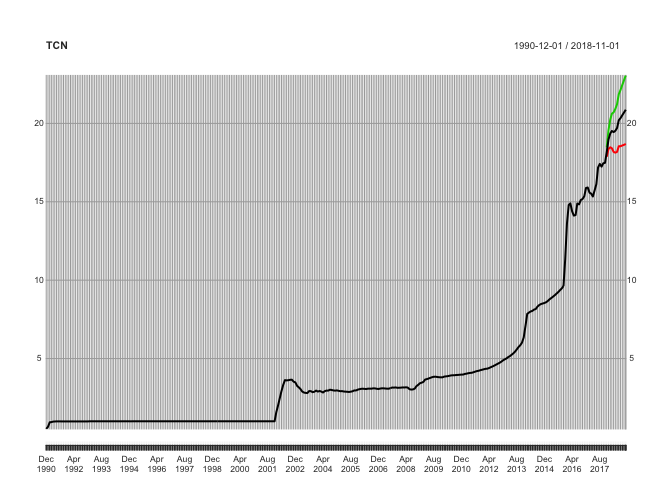

<!-- README.md is generated from README.Rmd. Please edit that file -->
PortalHacienda
==============

Un paquete de interface R a la API del Portal de Datos del Ministerio de Hacienda.

Instalación
-----------

You can install PortalHacienda from github with:

``` r
# install.packages("devtools")
devtools::install_github("fmgarciadiaz/PortalHacienda")
```

Ejemplo
-------

This is a basic example which shows you how to solve a common problem:

``` r
library(PortalHacienda)
#> Loading required package: zoo
#> 
#> Attaching package: 'zoo'
#> The following objects are masked from 'package:base':
#> 
#>     as.Date, as.Date.numeric
#> Acceso al Portal de Datos de Hacienda - v0.1 - 12-2017 - fgd
TCN <- Forecast(Get("138.1_PAPDE_0_M_41"),12)
#> [1] "Cargados 324 datos, desde 1990-12-01 hasta 2017-11-01 Periodicidad: monthly"
#> [1] "Serie extendida 12 períodos, usando el modelo auto detectado: ARIMA(5,2,1)(0,0,2)[12]"
plot(TCN)
```


