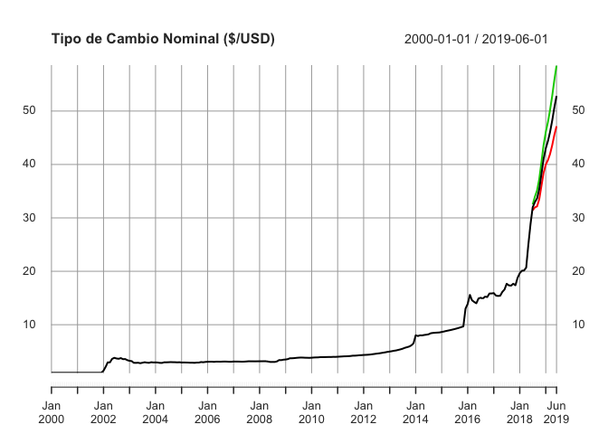

<!-- README.md is generated from README.Rmd. Please edit that file -->

# PortalHacienda

Un paquete básico de interface R a la API del [Portal de Datos del
Ministerio de Hacienda](https://www.minhacienda.gob.ar/datos/)

  - **Buscar** series en la descripción de los meta-datos
  - **Descargar** las series directamente de la API del Portal
  - **Extender y proyectar** rápidamente series descargadas
    (funcionalidad muy básica)

## Instalación

Para instalar el paquete en R ejecutar:

``` r
# install.packages("devtools")
devtools::install_github("fmgarciadiaz/PortalHacienda")
```

**Nota**: Debe instalarse previamente el paquete `devtools` para
permitir la descarga desde `github`.

## Ejemplo

Búsqueda de series **(a)** en el listado incluído en el paquete con
`Search` o **(b)** en la base online con `Search_online`.

``` r
# Cargar el paquete
library(PortalHacienda)
#> Loading required package: zoo
#> 
#> Attaching package: 'zoo'
#> The following objects are masked from 'package:base':
#> 
#>     as.Date, as.Date.numeric
#> ===========================================================================
#> Acceso API Portal datos Hacienda - v 0.1 - 12-2017 por Fernando García Díaz
#> Última actualización de la base de series incluída en el paquete: 0 días
# Buscar las series de tipo de cambio
Series_TCN <- Search("tipo de cambio")         
# mostrar las primeras series encontradas
# Series_TCN <- Search_online("tipo de cambio")         
knitr::kable(head(Series_TCN,3) ,"html") %>% kableExtra::kable_styling(font_size = 7)    
```

<table class="table" style="font-size: 7px; margin-left: auto; margin-right: auto;">

<thead>

<tr>

<th style="text-align:left;">

catalogo\_id

</th>

<th style="text-align:right;">

dataset\_id

</th>

<th style="text-align:right;">

distribucion\_id

</th>

<th style="text-align:left;">

serie\_id

</th>

<th style="text-align:left;">

indice\_tiempo\_frecuencia

</th>

<th style="text-align:left;">

serie\_titulo

</th>

<th style="text-align:left;">

serie\_unidades

</th>

<th style="text-align:left;">

serie\_descripcion

</th>

<th style="text-align:left;">

distribucion\_titulo

</th>

<th style="text-align:left;">

distribucion\_descripcion

</th>

<th style="text-align:left;">

distribucion\_url\_descarga

</th>

<th style="text-align:left;">

dataset\_responsable

</th>

<th style="text-align:left;">

dataset\_fuente

</th>

<th style="text-align:left;">

dataset\_titulo

</th>

<th style="text-align:left;">

dataset\_descripcion

</th>

<th style="text-align:left;">

dataset\_tema

</th>

<th style="text-align:left;">

serie\_indice\_inicio

</th>

<th style="text-align:left;">

serie\_indice\_final

</th>

<th style="text-align:right;">

serie\_valores\_cant

</th>

<th style="text-align:right;">

serie\_dias\_no\_cubiertos

</th>

<th style="text-align:left;">

serie\_actualizada

</th>

<th style="text-align:right;">

serie\_valor\_ultimo

</th>

<th style="text-align:right;">

serie\_valor\_anterior

</th>

<th style="text-align:right;">

serie\_var\_pct\_anterior

</th>

</tr>

</thead>

<tbody>

<tr>

<td style="text-align:left;">

sspm

</td>

<td style="text-align:right;">

115

</td>

<td style="text-align:right;">

115.1

</td>

<td style="text-align:left;">

115.1\_TCRM\_0\_A\_29

</td>

<td style="text-align:left;">

R/P1Y

</td>

<td style="text-align:left;">

tipo\_cambio\_real\_multilateral

</td>

<td style="text-align:left;">

Índice Dic-2001=100

</td>

<td style="text-align:left;">

Índice de Tipo de Cambio Real Multilateral: Valores anuales Índice
Diciembre 2001=100

</td>

<td style="text-align:left;">

Índice de Tipo de Cambio Real Multilateral. Valores anuales.

</td>

<td style="text-align:left;">

Índice de Tipo de Cambio Real Multilateral. Valores
anuales.

</td>

<td style="text-align:left;">

<http://infra.datos.gob.ar/catalog/sspm/dataset/115/distribution/115.1/download/indice-tipo-cambio-real-multilateral-valores-anuales.csv>

</td>

<td style="text-align:left;">

Subsecretaría de Programación Macroeconómica.

</td>

<td style="text-align:left;">

Banco Central de la República Argentina (BCRA)

</td>

<td style="text-align:left;">

Índice de Tipo de Cambio Real Multilateral Base Diciembre de 2001 = 100

</td>

<td style="text-align:left;">

Índice de Tipo de Cambio Real Multilateral Base Diciembre de 2001 = 100

</td>

<td style="text-align:left;">

Dinero y Bancos

</td>

<td style="text-align:left;">

1991-01-01

</td>

<td style="text-align:left;">

2015-01-01

</td>

<td style="text-align:right;">

25

</td>

<td style="text-align:right;">

715

</td>

<td style="text-align:left;">

TRUE

</td>

<td style="text-align:right;">

164.8982

</td>

<td style="text-align:right;">

908.6065

</td>

<td style="text-align:right;">

\-0.8185153

</td>

</tr>

<tr>

<td style="text-align:left;">

sspm

</td>

<td style="text-align:right;">

115

</td>

<td style="text-align:right;">

115.2

</td>

<td style="text-align:left;">

115.2\_TCRM\_0\_T\_29

</td>

<td style="text-align:left;">

R/P3M

</td>

<td style="text-align:left;">

tipo\_cambio\_real\_multilateral

</td>

<td style="text-align:left;">

Índice Dic-2001=100

</td>

<td style="text-align:left;">

Índice de Tipo de Cambio Real Multilateral: Valores trimestrales Índice
Diciembre 2001=100

</td>

<td style="text-align:left;">

Índice de Tipo de Cambio Real Multilateral. Valores trimestrales.

</td>

<td style="text-align:left;">

Índice de Tipo de Cambio Real Multilateral. Valores
trimestrales.

</td>

<td style="text-align:left;">

<http://infra.datos.gob.ar/catalog/sspm/dataset/115/distribution/115.2/download/indice-tipo-cambio-real-multilateral-valores-trimestrales.csv>

</td>

<td style="text-align:left;">

Subsecretaría de Programación Macroeconómica.

</td>

<td style="text-align:left;">

Banco Central de la República Argentina (BCRA)

</td>

<td style="text-align:left;">

Índice de Tipo de Cambio Real Multilateral Base Diciembre de 2001 = 100

</td>

<td style="text-align:left;">

Índice de Tipo de Cambio Real Multilateral Base Diciembre de 2001 = 100

</td>

<td style="text-align:left;">

Dinero y Bancos

</td>

<td style="text-align:left;">

1991-01-01

</td>

<td style="text-align:left;">

2015-10-01

</td>

<td style="text-align:right;">

100

</td>

<td style="text-align:right;">

715

</td>

<td style="text-align:left;">

FALSE

</td>

<td style="text-align:right;">

935.1308

</td>

<td style="text-align:right;">

884.1085

</td>

<td style="text-align:right;">

0.0577104

</td>

</tr>

<tr>

<td style="text-align:left;">

sspm

</td>

<td style="text-align:right;">

115

</td>

<td style="text-align:right;">

115.3

</td>

<td style="text-align:left;">

115.3\_TCRM\_0\_M\_29

</td>

<td style="text-align:left;">

R/P1M

</td>

<td style="text-align:left;">

tipo\_cambio\_real\_multilateral

</td>

<td style="text-align:left;">

Índice Dic-2001=100

</td>

<td style="text-align:left;">

Índice de Tipo de Cambio Real Multilateral: Valores mensuales Índice
Diciembre 2001=100

</td>

<td style="text-align:left;">

Índice de Tipo de Cambio Real Multilateral. Valores mensuales.

</td>

<td style="text-align:left;">

Índice de Tipo de Cambio Real Multilateral. Valores
mensuales.

</td>

<td style="text-align:left;">

<http://infra.datos.gob.ar/catalog/sspm/dataset/115/distribution/115.3/download/indice-tipo-cambio-real-multilateral-valores-mensuales.csv>

</td>

<td style="text-align:left;">

Subsecretaría de Programación Macroeconómica.

</td>

<td style="text-align:left;">

Banco Central de la República Argentina (BCRA)

</td>

<td style="text-align:left;">

Índice de Tipo de Cambio Real Multilateral Base Diciembre de 2001 = 100

</td>

<td style="text-align:left;">

Índice de Tipo de Cambio Real Multilateral Base Diciembre de 2001 = 100

</td>

<td style="text-align:left;">

Dinero y Bancos

</td>

<td style="text-align:left;">

1991-01-01

</td>

<td style="text-align:left;">

2015-12-01

</td>

<td style="text-align:right;">

300

</td>

<td style="text-align:right;">

715

</td>

<td style="text-align:left;">

FALSE

</td>

<td style="text-align:right;">

1040.5832

</td>

<td style="text-align:right;">

888.2220

</td>

<td style="text-align:right;">

0.1715350

</td>

</tr>

</tbody>

</table>

Bajar serie con `Get` y extender 12 períodos con `Forecast` (usa modelo
auto-detectado del paquete ***forecast*** y extiende según la frecuencia
detectada, días, meses o años). Luego hacer un plot sencillo.

``` r

TCN <- Forecast(Get("174.1_T_DE_CATES_0_0_32" , start_date = 2000), 12)       
#> [1] "Cargados 215 datos, desde 2000-01-01 hasta 2017-11-01 Periodicidad estimada: monthly"
#> [1] "Serie extendida 12 períodos, usando el modelo auto detectado: ARIMA(0,2,1)(0,0,2)[12]"
# Mostrar resultado
plot(TCN , main = "Tipo de Cambio Nominal ($/USD)")
```

<!-- -->

### Notas

Las series se cargan en formato XTS, con la periodicidad auto-detectada
por el paquete `xts`. La periocidiad es usada por la función `Forecast`
para correcta detección de *estacionalidad* y *lags*. `Forecast` agrega
demás intervalos de confianza del 95%. Las series diarias tienen un tope
de **1000** datos (dado el límite actual de la API)

# Estado del Proyecto

  - \[x\] Funcionalidad básica
  - \[ \] Captura de errores de uso o en la devolución de datos
  - \[ \] Otros
