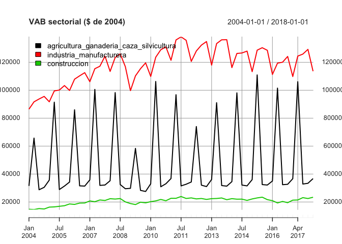

<!-- README.md is generated from README.Rmd. Please edit that file -->


# PortalHacienda

Un paquete básico de interfase a la API del [Portal de Datos del Ministerio de Hacienda](https://www.minhacienda.gob.ar/datos/)

- **Buscar** series en la descripción de los meta-datos
- **Descargar** las series directamente de la API del Portal
- **Extender y proyectar** rápidamente series descargadas (funcionalidad muy básica) 


## Instalación

Para instalar el paquete en R ejecutar:


```r
# install.packages("devtools")
devtools::install_github("fmgarciadiaz/PortalHacienda")
```

**Nota**: Debe instalarse previamente el paquete `devtools` para permitir la descarga desde `github`.

## Ejemplo

Búsqueda de series **(a)** en el listado incluído en el paquete con `Search` o **(b)** en la base online con 
`Search_online`.


```r
# Cargar el paquete
library(PortalHacienda)
#> Loading required package: zoo
#> 
#> Attaching package: 'zoo'
#> The following objects are masked from 'package:base':
#> 
#>     as.Date, as.Date.numeric
#> =============================================================================
#> Acceso API Portal Datos Hacienda - v 0.5.1 - 12-2017 por F. García Díaz
#> Última actualización de la base de series incluída en el paquete: 0 días
#> Series en la base de meta-datos: 20182
# Buscar las series de tipo de cambio
Series_TCN <- Search("tipo de cambio")         
# mostrar las primeras series encontradas
# Series_TCN <- Search_online("tipo de cambio")         
knitr::kable(head(Series_TCN,3) ,"html") %>% kableExtra::kable_styling(font_size = 7)    
```

<table class="table" style="font-size: 7px; margin-left: auto; margin-right: auto;">
 <thead>
  <tr>
   <th style="text-align:left;"> serie_id </th>
   <th style="text-align:left;"> serie_descripcion </th>
   <th style="text-align:left;"> indice_tiempo_frecuencia </th>
   <th style="text-align:left;"> serie_indice_inicio </th>
   <th style="text-align:left;"> serie_indice_final </th>
  </tr>
 </thead>
<tbody>
  <tr>
   <td style="text-align:left;"> tcrse_2weZeH </td>
   <td style="text-align:left;"> Índice de Tipo de Cambio Real Sectorial Efectivo. Producción y procesamiento  de alimentos </td>
   <td style="text-align:left;"> R/P1M </td>
   <td style="text-align:left;"> 2014-01-01 </td>
   <td style="text-align:left;"> 2018-06-01 </td>
  </tr>
  <tr>
   <td style="text-align:left;"> tcrse_49xDd3 </td>
   <td style="text-align:left;"> Índice de Tipo de Cambio Real Sectorial Efectivo. Actividades de impresión </td>
   <td style="text-align:left;"> R/P1M </td>
   <td style="text-align:left;"> 2014-01-01 </td>
   <td style="text-align:left;"> 2018-06-01 </td>
  </tr>
  <tr>
   <td style="text-align:left;"> tcrse_4sgTaJ </td>
   <td style="text-align:left;"> Índice de Tipo de Cambio Real Sectorial Efectivo. Productos del cuero </td>
   <td style="text-align:left;"> R/P1M </td>
   <td style="text-align:left;"> 2014-01-01 </td>
   <td style="text-align:left;"> 2018-06-01 </td>
  </tr>
</tbody>
</table>

Bajar serie de tipo de cambio con `Get` y extender 12 períodos con `Forecast` (usa modelo auto-detectado del paquete ***forecast*** y extiende según la frecuencia detectada, días, meses o años). 
Luego hacer un plot sencillo.


```r

TCN <- Forecast(Get("174.1_T_DE_CATES_0_0_32" , start_date = 2000), 12)       
#> [1] "Cargada/s las series: 174.1_T_DE_CATES_0_0_32. Descripción: Tipo de Cambio En $ equivalentes"
#> [1] "Cargados 222 datos, desde 2000-01-01 hasta 2018-06-01 Periodicidad estimada: monthly"
#> [1] "Serie extendida 12 períodos, usando el modelo auto detectado: ARIMA(3,2,3)"
# Mostrar resultado
plot(TCN , main = "Tipo de Cambio Nominal ($/USD)")
```

<!-- -->

También se pueden obtener varias series al mismo tiempo, separando con comas...


```r
plot(Get("6.2_AGCS_2004_T_39,6.2_IM_2004_T_23,6.2_C_2004_T_12") , legend.loc = "topleft" , main = "VAB sectorial ($ de 2004)")
#> [1] "Cargada/s las series: c(\"6.2_AGCS_2004_T_39\", \"6.2_C_2004_T_12\", \"6.2_IM_2004_T_23\"). Descripción: c(\"Valor agregado bruto trimestral a precios de productor, de agricultura ganaderia caza y silvicultura en pesos de 2004\", \"Valor agregado bruto trimestral a precios de productor de construcción en pesos de 2004\", \"Valor agregado bruto trimestral a precios de productor de industria manufacturera en pesos de 2004\")"
#> [1] "Cargados 171 datos, desde 2004-01-01 hasta 2018-01-01 Periodicidad estimada: quarterly"
```

<!-- -->

En caso de cargar varias series y desear proyecciones automáticas, utilizar la
variante vectorial de `Forecast`, que es `vForecast`:


```r
TCN <- vForecast(Get("120.1_PCE_1993_0_24,120.1_ED1_1993_0_26"),12)
#> [1] "Cargada/s las series: c(\"120.1_ED1_1993_0_26\", \"120.1_PCE_1993_0_24\"). Descripción: c(\"Exportaciones de bienes en millones de dólares de 1993\", \"Poder de compra de las exportaciones de bienes en millones de dólares de 1993\")"
#> [1] "Cargados 64 datos, desde 1986-01-01 hasta 2017-01-01 Periodicidad estimada: yearly"
#> [1] "Serie extendida 12 períodos, usando modelo auto detectado"
```

### Notas
Las series se cargan en formato XTS, con la periodicidad auto-detectada por el paquete `xts`.
La periocidiad es usada por la función `Forecast` para correcta detección de *estacionalidad* y *lags*. `Forecast` agrega demás intervalos de confianza del 95%.
Las series diarias tienen un tope de **1000** datos (dado el límite actual de la API)

# Estado del Proyecto

- [x] Funcionalidad *básica*
- [x] Captura de errores de uso o en la devolución de datos (básico)
- [ ] Captura de errores avanzada
- [ ] Otros
